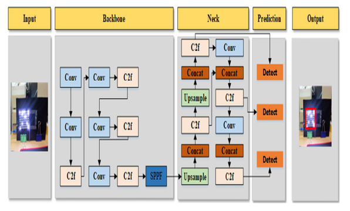
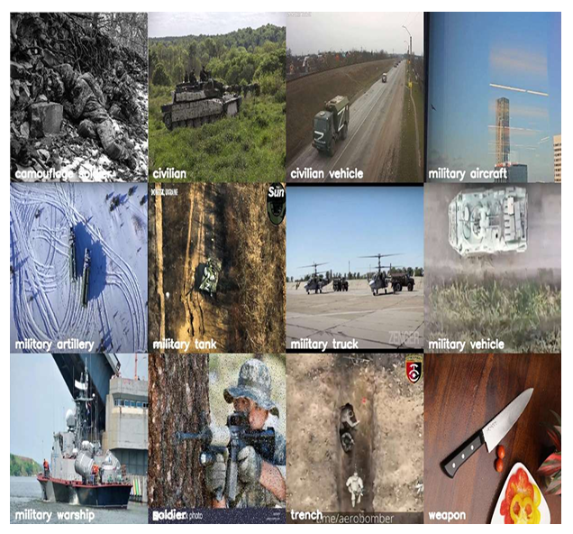
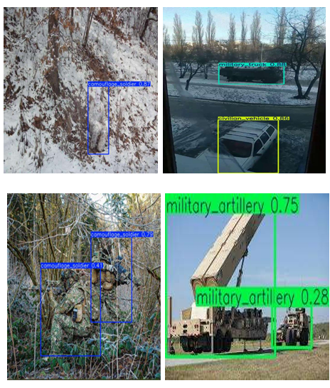
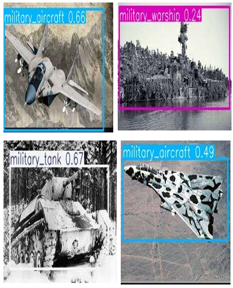

# Camouflaged Military Object Detection (YOLOv8)

Modern Flask-based web app for image upload and live webcam detection using a custom YOLOv8 model. Includes LandingLens-inspired UI, prioritized model loading (`best (1).pt`), and API endpoints for live detection.


## Project Highlights
- YOLOv8 custom model with prioritized load order (`models/best (1).pt` → fallback `yolov8n.pt`).
- Live detection via `/api/live_detect` (base64 frames) with annotated frame return.
- Upload workflow with extension/mimetype checks and 16 MB limit.
- Clean structure with blueprints and service layer:
  - `app/` (factory, routes, services)
  - `templates/`, `static/`
  - `models/` (place `best (1).pt`)
- LandingLens-inspired frontend (minimal, light theme).

## Repository Structure
```
.
├─ app/
│  ├─ __init__.py          # app factory, config load, blueprints
│  ├─ routes/
│  │  ├─ web.py            # HTML routes (/ , /model_info, /performance, /predict)
│  │  └─ api.py            # JSON API (/api/live_detect, /api/status)
│  └─ services/
│     └─ model_service.py  # YOLO load, inference, base64 decode
├─ static/
│  ├─ css/, js/, images/   # assets and provided diagrams/figures
│  └─ uploads/             # runtime annotated outputs
├─ templates/              # Jinja2 templates
├─ models/                 # place best (1).pt here
├─ app.py                  # entrypoint (uses create_app)
├─ config.py               # Dev/Prod configs (env-driven)
├─ requirements.txt
└─ tests/ (suggested)      # add pytest-based API checks
```

## Quickstart (Local)

**📖 For detailed step-by-step instructions, see [SETUP_GUIDE.md](SETUP_GUIDE.md)**

Quick start:

1) **Python env**
```bash
python -m venv venv
venv\Scripts\activate   # on Windows
# or: source venv/bin/activate
```

2) **Install dependencies**
```bash
pip install -r requirements.txt
pip install ultralytics   # if not pinned in requirements.txt
```

3) **Add your model**
- Place `best (1).pt` in `models/`.

4) **Run**
```bash
python app.py
# Visit: http://127.0.0.1:5000/predict
```

**💡 New to the project?** Check out [SETUP_GUIDE.md](SETUP_GUIDE.md) for comprehensive setup instructions, troubleshooting, and VS Code/Copilot tips.

## API
- `POST /api/live_detect`
  - Body (JSON): `{ "image": "data:image/jpeg;base64,...." }`
  - Response: `{ success, detections, count, annotated_image }`
- `GET /api/status`
  - Returns `{ model_loaded: bool }`

## Security & Safety
- `SECRET_KEY` and limits from env (`config.py`); defaults provided for dev.
- Upload hardening: extension & mimetype checks; 16 MB cap.
- Model caching avoids reload on each request.

## Model & Pipeline Visuals

Architecture (YOLOv8 Backbone/Neck/Head):


Dataset examples:




System flow:


Confusion matrix:


Confidence curve:


Precision-Recall curve:


Precision-Confidence matrix:


## Testing (suggested)
- Convert existing helper scripts into pytest tests:
  - `/predict` upload success
  - `/api/live_detect` JSON success with sample base64
  - Error cases: missing file, bad mimetype, missing image field

## Deployment

**🚀 Ready for production!** See [DEPLOYMENT.md](DEPLOYMENT.md) for complete deployment guides.

### Quick Deploy Options:

1. **⭐ Render** (Recommended - Easiest)
   - Free tier available
   - Automatic HTTPS
   - Git-based deployment
   - See [DEPLOYMENT.md](DEPLOYMENT.md#1-render--recommended---easiest)

2. **Railway** (Great Alternative)
   - Simple setup
   - $5 free credit/month
   - See [DEPLOYMENT.md](DEPLOYMENT.md#2-railway--great-alternative)

3. **AWS EC2** (For GPU/Full Control)
   - Full server control
   - GPU instances available
   - See [DEPLOYMENT.md](DEPLOYMENT.md#3-aws-ec2-for-gpuhigh-performance)

4. **Docker** (Universal)
   - Works on any platform
   - See [DEPLOYMENT.md](DEPLOYMENT.md#4-docker-deployment-universal)

### Production Checklist:
- ✅ `wsgi.py` created for production servers
- ✅ `gunicorn` added to requirements.txt
- ✅ Security headers configured
- ✅ Error handling for production
- ✅ Environment-based configuration
- ✅ Logging configured

**📖 Full deployment guide:** [DEPLOYMENT.md](DEPLOYMENT.md)

## Team & Contributions

Below are the core contributors to this project along with their primary roles and a short list of contributions. The images displayed are for visual reference.

<p align="center">
  
  
  
</p>

### Osama Mikrani — Lead Backend & Deployment Engineer
- Role: Backend engineer and deployment lead
- Contributions:
  - Implemented the Flask application factory and blueprint structure
  - Built the model service (loading, caching, inference helpers)
  - Added production entrypoints (`wsgi.py`, `Procfile`) and deployment guidance
  - Wrote the model discovery and fallback logic

### Pavan U — Data & Augmentation Engineer
- Role: Dataset engineer and augmentation specialist
- Contributions:
  - Curated and preprocessed the training/validation datasets
  - Designed augmentation pipelines and data formatting for YOLOv8
  - Assisted with label quality checks and dataset splits for robust evaluation

### Raghu G R — Model Architect & Evaluation Lead
- Role: Model architecture and evaluation
- Contributions:
  - Selected and tuned the YOLOv8 variant for this task
  - Performed model fine-tuning, hyperparameter selection, and evaluation
  - Produced the performance artifacts (confusion matrices, PR curves) shown in the repo

### Yogesh Rebari — Frontend & Integration Engineer
- Role: Frontend developer and integration lead
- Contributions:
  - Implemented the UI templates, upload flow, and the live-detection client
  - Integrated the frontend with the inference API and improved UX for results
  - Wrote documentation and setup guides for local and cloud deployment

If you want me to include short links to each contributor's GitHub profile or a short contact line, tell me which handles to add and I will update the README accordingly.


