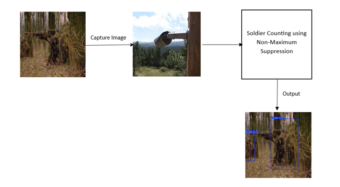
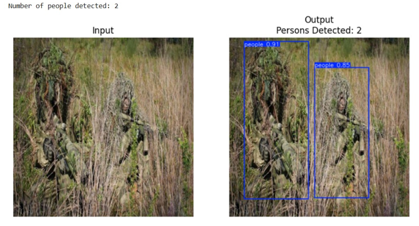
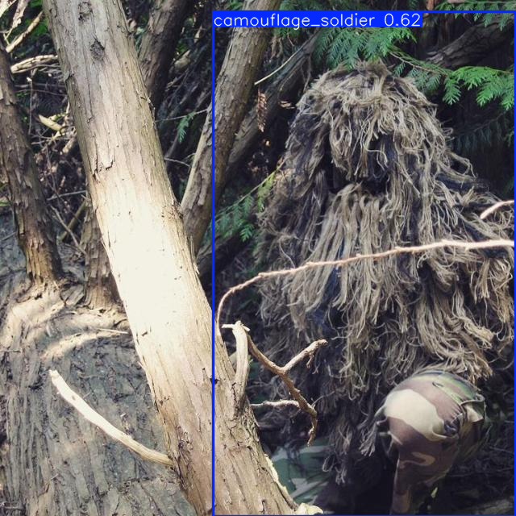
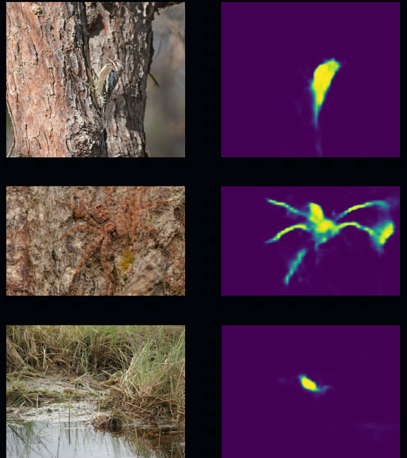

# YOLOv8 Flask Demo



A simple Flask web app that integrates YOLOv8 (Ultralytics) for image object detection. Upload an image on the `/predict` page and the server will return an annotated image showing detected objects.

---

## Demo Images

Left: cod01 • Center: cod02 • Right: cod03




A camo-style sample:



---

## Features
- Upload images via a friendly web UI (`/predict`).
- Server-side YOLOv8 inference (Ultralytics).
- Annotated result returned and saved to `static/uploads/`.
- Secure filename handling and upload size limit.
- Docker-ready for easy deployment.

---

## Quick start (local, venv)

1. Create and activate a virtual environment (Windows PowerShell):

```powershell
python -m venv .venv
.\.venv\Scripts\Activate.ps1
```

2. Install dependencies:

```powershell
pip install -r requirements.txt
```

3. Place your YOLOv8 weights in `models/` (see `MODEL_SETUP_GUIDE.md`). Example: `models/best.pt`.

4. Run the app:

```powershell
python app.py
```

Open http://127.0.0.1:5000/predict and try uploading an image.

---

## Run with Docker (recommended for deployment/demo)

Build and run locally (CPU):

```powershell
docker build -t yolo-flask-app:latest .
docker run --rm -p 5000:5000 -v ${PWD}/static/uploads:/app/static/uploads yolo-flask-app:latest
```

Place model weights in `models/` before building container, or bake them into the image.

---

## Deploying
See `DEPLOY.md` for a quick guide covering Render, AWS EC2 (GPU), and Docker Hub.

---

## Model setup
See `MODEL_SETUP_GUIDE.md` for details on placing trained weights in `models/` and troubleshooting model loading errors.

---

## Contribution
- Open an issue to discuss features or report bugs.
- Feel free to submit a PR — keep changes small and focused.

---

## License
Choose a license for your repo (MIT recommended for demos).

---

Thanks! If you'd like, I can:
- Add a GitHub Actions workflow to build and push the Docker image.
- Create a `docker-compose.yml` for local dev with volumes and environment variables.
- Add example unit tests for the Flask app.

Tell me which you'd like next and I'll implement it.
